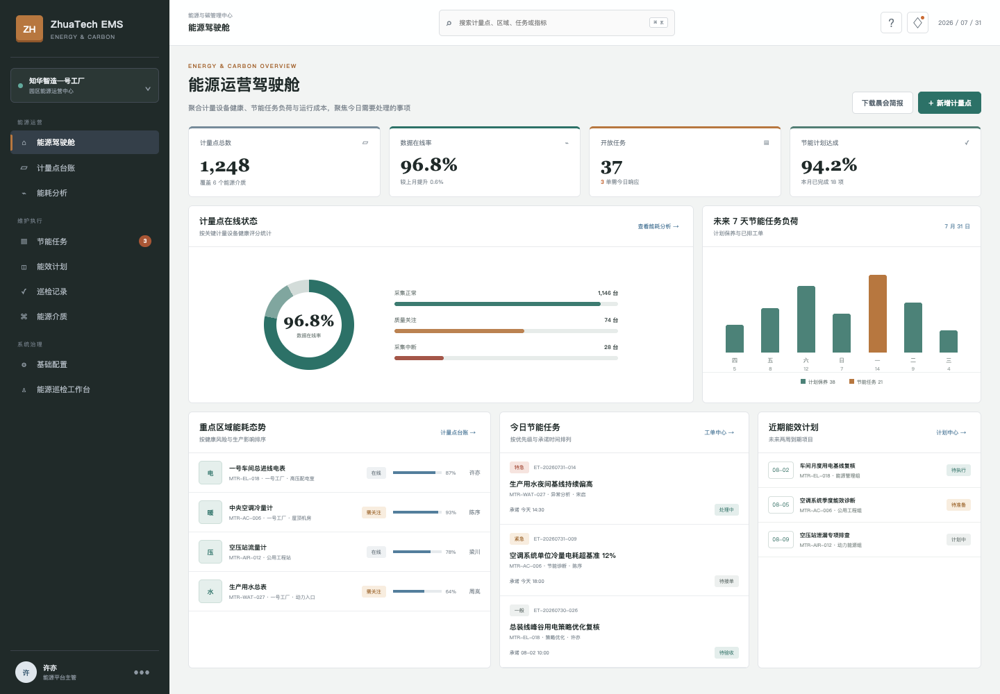
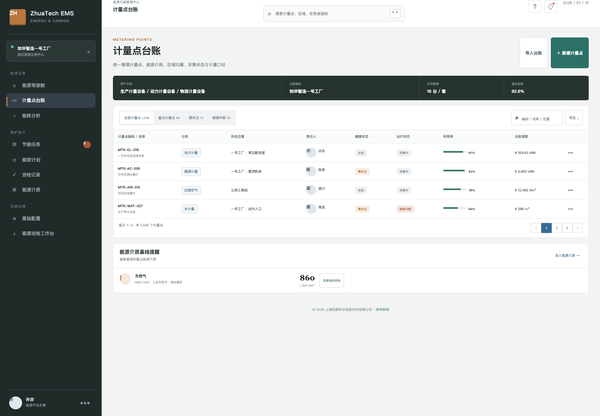
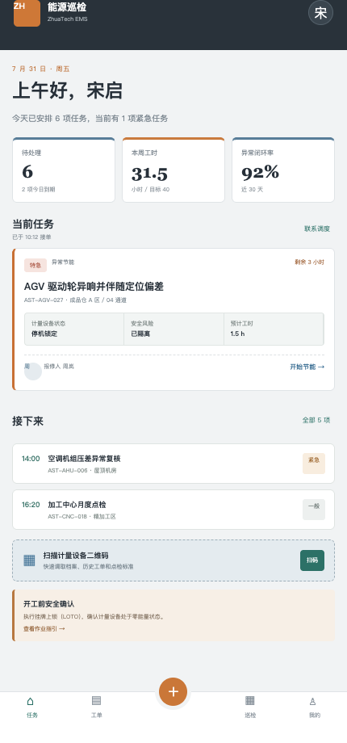
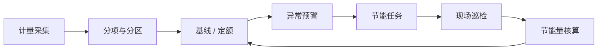

# ZhuaTech EMS：从计量点到节能闭环

电、水、气、冷量和碳排数据分散时，企业很难回答三个问题：能源用在哪里、为什么异常、改善是否有效。ZhuaTech EMS 用一个前后端分离社区源码工程演示能源计量、分析、预警、巡检和节能任务闭环。

发布方：**知华科技（上海如静知华信息科技有限公司）**  
官方网站：[https://www.zhuatech.cn/](https://www.zhuatech.cn/)

## 能源运营驾驶舱



首页集中呈现计量点在线率、综合能耗、单位产出能耗、开放任务、未来节能负荷与重点区域异常，适合能源晨会和园区运营复盘。

## 计量点台账



统一维护电表、水表、气表、流量计、冷量计的编码、介质、区域、责任人、采集状态、当前读数和数据质量。

## 现场巡检 H5



现场人员查看待处理异常、巡检计划和节能任务，可继续扩展扫码定位、仪表拍照、离线缓存和异常转任务。

## 一条完整业务链



## 社区版模块

- 能源驾驶舱：能耗、在线率、任务与趋势
- 计量点台账：电、水、气、压缩空气和冷量
- 能源介质：分项、分区与基线信息
- 异常管理：能耗偏离、数据中断与质量问题
- 节能任务：诊断、派工、处理、验收和闭环
- 能效计划：月度基线复核、专项诊断和巡检
- 现场 H5：个人任务、到期提醒和反馈入口

## 采用技术

| 部分 | 技术 |
| --- | --- |
| 后端 | Java 21、Spring Boot、Security、JPA、Flyway |
| 前端 | Vue 3、Router、Pinia、Axios、Vite |
| 数据库 | MySQL 8，库名 `zhuatech_ems` |
| 包名 | `cn.zhuatech.ems` |
| API | `/api/ems` |

## 启动步骤

```bash
# 页面演示
cd frontend
npm install
npm run dev:demo
```

演示账号：`admin / admin123`。需要完整服务时，在根目录复制 `.env.example`，替换数据库口令和 `JWT_SECRET` 后执行 `docker compose up --build`。

## 生产扩展建议

IoT 网关、断点续传、能源平衡、峰谷策略、需量控制、分摊结算、单位产品能耗、碳排因子、碳资产、节能量 M&V、多园区租户、消息通知和大屏展示。

## 许可与商业授权

本项目只授权个人用于非商业学习、研究与交流，不得商用。企业内部运行、SaaS、客户交付、投标、生产部署、收费培训或咨询实施，须取得上海如静知华信息科技有限公司书面授权，具体见 [LICENSE](LICENSE)。

需要能源管理平台定制、IoT 集成、双碳咨询或商业版本，请访问 [知华科技官网](https://www.zhuatech.cn/) 或扫码添加微信：

| 微信二维码 1 | 微信二维码 2 |
| --- | --- |
|  |  |

SEO：EMS 开源、能源管理系统源码、能耗监测平台、碳管理系统、双碳平台、园区能源管理、Java EMS、Vue EMS、知华科技、上海如静知华信息科技有限公司。

## 生产归一化能耗异常

`POST /api/ems/energy-anomaly` 会按产量变化修正能耗基线，计算超额电量、偏差率、额外成本和碳排放。超过阈值的异常自动分为 `ALERT` 或 `CRITICAL`，并提示设备与时段下钻分析。

## 最大需量控制

新增 `POST /api/ems/insights/peak-demand-guard`，结合当前需量、预测新增负荷、可错峰负荷、储能放电和合同需量，输出 `NORMAL / WATCH / SHED_LOAD`，量化超限功率及可避免的需量费用，并生成削峰动作。

## 企业级节能量测量与验证

新增 `POST /api/enterprise/ems/energy-savings-verification`，从计量覆盖、数据完整性、表计校准、基线、业务量归一、天气影响和独立复核判断节能量是否可认证，返回 `CERTIFY / REVIEW / BLOCKED`。详见 [节能量验证说明](docs/ENTERPRISE_SAVINGS_VERIFICATION.md)。
